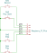

# MIDI footswitch

This implements a USB MIDI footswitch on a Raspberry Pi Pico microcontroller. It
is configured to control an AKAI MPC X/Live/Live II/One/Touch.

For pictures and details, see the [corresponding blog
post](https://po-ru.com/2020/08/03/diy-usb-midi-footswitch).

## Features

- Presses are debounced
- Each button can be configured to send an additional command when held down.
  For example, the stop button will send the reset command when held for longer
  than 1/4 second.

## Software

### Compiling and uploading with Make

#### Prerequisites

- [Raspberry Pi Pico SDK](https://github.com/raspberrypi/pico-sdk)
- cmake
- OpenSCAD (if 3D printing the hardware)

#### Build

In the `software` directory, run `cmake` to generate `Makefile`

    PICO_SDK_PATH=/path/to/sdk cmake

To build the code

    make

To program the device:

- Hold down the button on the Pico board while plugging in the device.
- Copy the `.uf2` file to the device.

## Hardware

Four footswitches share a common connection to ground (pin 3). The other
terminal of each is connected to GP0-GP3 (pins 1, 2, 4 and 5) respectively.
The code can be adjusted for more or fewer switches.

### BOM

- Hammond 1590XX enclosure
- 4 momentary push-to make footswitches
- Raspberry Pi Pico
- Panel-mount USB B socket micro USB cable
- 4 M2 × 5mm pan head self-tapping screws

### Switch connections

### 3D-printed components

OpenSCAD models for a bezel to surround the socket, a bracket to hold the
microcontroller, and a couple of tools to help line up the switches and feet
are included in the `hardware` directory. To build the STL files, run `make` in
the `hardware` directory.

The parts are as follows:

- `foot-aligner.scad` -- a corner bracket to facilitate aligning sticky feet
  consistently with the corner of the enclosure.
- `pico-mount.scad` -- a frame that is held in place by the footswitches, to
  which the Pico may be screwed with M2 × 5mm self-tapping screws.
- `switch-spacer.scad` -- helps with offsetting the lower nut on footswitches
  so that they protrude a consistent distance above the top. May require
  variation for your switches.
- `usb-bezel.scad` -- a bezel to allow fitting the USB B socket by drilling
  only round holes. May require adjustment for your socket.
- `usb-drill-template` -- drill straight through this to get consistent, even
  holes for mounting the USB socket. May require adjustment for different
  sockets.
